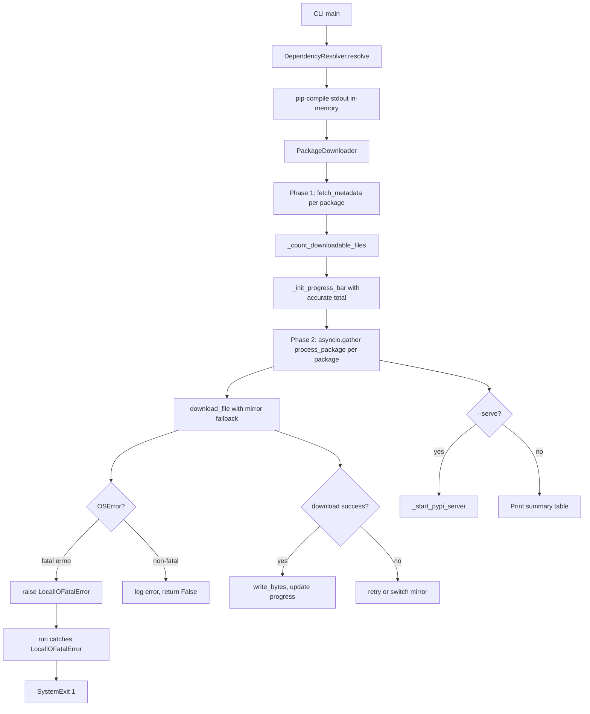

# pypi-downloader Product Requirements Document (PRD)

Version: 0.8.1

---

## 1. Product Overview

pypi-downloader is an async CLI tool for downloading Python packages from PyPI (or Chinese mirrors) and serving them as a private offline index. It is designed for air-gapped or restricted network environments where developers cannot access the public internet directly.

---

## 2. Functional Requirements

### 2.1 Dependency Resolution

- Dependencies MUST always be resolved via `pip-compile` (pip-tools) before downloading.
- Resolution MUST support both official PyPI and Chinese mirrors (controlled by `--cn`).
- When `--cn` is set, pip-compile uses `https://mirrors.tuna.tsinghua.edu.cn/pypi/web/simple` as its index URL.
- Resolved output MUST be returned as an in-memory string; no temporary files are written to disk.
- The `DependencyResolver` class in `resolver.py` encapsulates all pip-compile interactions.
- pip-compile is invoked as `sys.executable -m piptools compile <input> -o - --no-header` to ensure the correct virtual environment is used.

### 2.2 Requirements Parsing

- `PackageDownloader.parse_package_line()` parses each line of the resolved requirements string.
- Supported formats:
  - `package==version` (standard pinned)
  - `package[extras]==version` (with extras)
  - `package` (name only, used in `--all-versions` mode)
- Lines starting with `#` or empty lines MUST be silently ignored.
- Lines that do not match any supported format MUST be logged as a warning and skipped.

### 2.3 Package Metadata

- Metadata is fetched from the PyPI JSON API: `https://pypi.org/pypi/{package}/json`.
- For Chinese mirrors, the equivalent endpoint is `{mirror}/web/json/{package}`.
- Metadata fetch uses the same mirror fallback logic as file downloads.
- On JSON decode failure, the mirror is treated as failed and the next mirror is tried.

### 2.4 Package Download

- Downloads MUST be performed asynchronously using `aiohttp`.
- Default concurrency is 16 streams, configurable via `--concurrency`.
- Each downloaded file MUST be verified against the SHA-256 digest from the PyPI JSON API (`digests.sha256` field).
- Hash verification is performed in-memory immediately after download, before writing to disk.
- If a file already exists and its SHA-256 hash matches the expected value, the download MUST be skipped.
- If a file exists but its hash does not match, it MUST be re-downloaded.
- File I/O (write, hash computation, existence check) MUST run in a `ThreadPoolExecutor` to avoid blocking the event loop.
- Hash computation uses chunked reading (8 KB blocks) to avoid loading entire files into memory.
- Local I/O errors MUST be classified before retrying. Errors in `_FATAL_LOCAL_ERRNO` (ENOSPC, EDQUOT, EROFS) MUST raise `LocalIOFatalError` immediately, aborting all downloads. Other `OSError` variants log an error and skip only the affected file.

### 2.5 URL Rewriting

- When `--cn` is set, download URLs from `https://files.pythonhosted.org/packages/` are rewritten to use the current mirror's equivalent path (`{mirror}/web/packages/`).
- When using official PyPI, URLs are used as-is.
- URL rewriting is performed by `PackageDownloader.rewrite_url()` immediately before each download attempt.

### 2.6 Mirror Fallback

- When `--cn` is set, 14 Chinese mirrors are shuffled randomly at startup, with official PyPI appended as the last resort (15 sites total).
- When `--cn` is not set, only official PyPI (`https://pypi.org`) is used.
- After `RETRIES_PER_MIRROR` (2) consecutive failures on a mirror, the tool MUST switch to the next mirror.
- Total retry budget per file is `DEFAULT_RETRIES` (32).
- The mirror index is restored to its original value after each file download attempt (success or failure), so concurrent downloads do not interfere with each other's mirror state.
- The User-Agent header is set to `pip/24.0 (python X.Y.Z)` to avoid being blocked by PyPI mirrors.

### 2.7 Version Filtering

- `--all-versions`: download all Python 3 compatible versions of each package.
- `--latest-patch`: for each (major, minor) group, keep only the highest patch version. Uses PEP 440 compliant comparison via the `packaging` library.
- `--all-versions` and `--latest-patch` are mutually exclusive; the CLI MUST reject both being set simultaneously.
- Python 2 only wheels (no py3/cp3 tags) MUST always be filtered out regardless of other flags.
- A version is considered Python 3 compatible if any of its files is a source distribution or has a `py3`/`cp3x` wheel tag.

### 2.8 Platform Filtering

- `--python-version`, `--abi`, `--platform` filter wheel files by their PEP 425 tags.
- Each filter supports compressed tags (dot-separated, e.g., `py2.py3`); a file passes if any of its tags matches any of the filter tags.
- Source distributions (`.tar.gz`, `.zip`) always pass through platform filters.
- Filtering logic is implemented in `PackageDownloader.matches_filter()`.

### 2.9 Dry-Run Mode

- When `--dry-run` is set, no files are downloaded.
- All resolved download URLs MUST be collected and saved to a file (default: `./url_list.txt`, configurable via `--url-list-path`).
- If no URLs are collected, the URL list file MUST NOT be created.

### 2.10 Private PyPI Server

- When `--serve` is set (and `--dry-run` is not), a `pypiserver` instance MUST be started after downloading completes.
- The server is launched as `sys.executable -m pypiserver run --port {port} {download_dir}`.
- Default port is 8080, configurable via `--serve-port`.
- `pypiserver` is an optional dependency; a clear error message MUST be shown if it is not installed.
- The server blocks until the user sends Ctrl+C, which MUST be handled gracefully.

### 2.11 Progress Display

- During downloads, a Rich Live display MUST show the last 20 log lines and a progress bar.
- The progress bar shows: description, visual bar, percentage, and file count (completed/total).
- The total file count MUST be computed in Phase 1 (metadata phase) before Phase 2 (download phase) begins, so the progress bar starts with an accurate total.
- Progress MUST be incremented exactly once per file: on success, on skip (hash match), or on failure (after all retries exhausted).

---

## 3. Non-Functional Requirements

### 3.1 Performance

- Phase 1 (metadata fetch) runs sequentially per package to avoid overwhelming mirrors.
- Phase 2 (download) runs all packages concurrently via `asyncio.gather`, controlled by a semaphore.
- Thread pool size: `min(32, CPU_COUNT * 4)`.
- Hash computation uses 8 KB chunked reads to keep memory usage constant regardless of file size.
- Files that already exist with a valid hash are skipped without any network request.

### 3.2 Error Handling

- Network errors (`aiohttp.ClientError`, `asyncio.TimeoutError`) trigger mirror switching after `RETRIES_PER_MIRROR` consecutive failures.
- Hash mismatch after download is a non-retryable error for that file; the file is not saved.
- Fatal local I/O errors (`LocalIOFatalError`) abort the entire download immediately with exit code 1.
- Non-fatal local I/O errors (other `OSError`) skip only the affected file and continue.
- Unexpected exceptions in `process_package` are caught, logged with full traceback, and recorded in the package status; they do not abort other packages.

### 3.3 Logging

- All log output uses `loguru`.
- Phase 1 (setup and resolution) uses a plain stderr sink at INFO+ level.
- Phase 2 (download) switches to a Rich Live sink at DEBUG+ level, showing the last 20 lines.
- A rotating log file (`pypi-downloader.log`, 10 MB rotation, 3 backups) captures TRACE+ level at all times.
- Download URLs are logged at TRACE level (file only, not shown on screen).
- Fatal errors are logged at CRITICAL level before aborting.

### 3.4 Compatibility

- Requires Python 3.11+.
- Wheel filename parsing follows PEP 425.
- Version comparison follows PEP 440 via the `packaging` library.
- Requirements file parsing supports the `package[extras]==version` format used by pip-compile output.

---

## 4. Data Model

### 4.1 Package Status Dictionary

Each call to `process_package()` returns a `Dict[str, Any]` with the following keys:

| Key | Type | Description |
|---|---|---|
| `package` | `str` | Package name (with extras if applicable) |
| `version` | `str` | Version string, or `"all (N versions)"` / `"latest-patch (N versions)"` |
| `status` | `str` | One of the status values below |
| `details` | `str` | Human-readable detail message |

### 4.2 Package Status Values

| Status | Meaning |
|---|---|
| `Synchronized` | All downloadable files were successfully downloaded or already existed |
| `Partial Sync` | Some but not all files were downloaded successfully |
| `Failed` | No files were downloaded |
| `No Files` | No downloadable files found after applying filters |
| `Error (Pre-filter)` | Line could not be parsed (should not occur in normal operation) |

---

## 5. Architecture



---

## 6. CLI Reference

| Argument | Type | Default | Description |
|---|---|---|---|
| `requirements` | positional str | `./requirements.txt` | Path to requirements.txt |
| `-r`, `--requirement` | str | — | Alternative path to requirements.txt |
| `--dry-run` | flag | false | Collect URLs only, do not download |
| `--concurrency` | int | 16 | Max concurrent downloads |
| `--download-dir` | str | `./pypi` | Directory to save packages |
| `--cn` | flag | false | Use Chinese mirrors with fallback |
| `--serve` | flag | false | Start pypiserver after downloading |
| `--serve-port` | int | 8080 | Port for pypiserver (requires `--serve`) |
| `--python-version` | str | — | Filter by Python tag (e.g., `cp311`, `py3`) |
| `--abi` | str | — | Filter by ABI tag (e.g., `cp311`, `abi3`) |
| `--platform` | str | — | Filter by platform tag (e.g., `manylinux_2_17_x86_64`) |
| `--all-versions` | flag | false | Download all Python 3 versions |
| `--latest-patch` | flag | false | Download only latest patch per minor version |
| `--url-list-path` | str | `./url_list.txt` | URL list output path (dry-run only) |

Mutually exclusive pairs: `--all-versions` and `--latest-patch`.

---

## 7. Exception Hierarchy

```
Exception
└── LocalIOFatalError          # Base: local I/O error, retrying mirrors is pointless
    └── DiskFullError          # Concrete: ENOSPC / EDQUOT (backward-compatible subclass)
```

`_FATAL_LOCAL_ERRNO` (module-level `frozenset`) controls which errno values trigger `LocalIOFatalError`:

| errno | Constant | Meaning |
|---|---|---|
| 28 | `ENOSPC` | No space left on device |
| 122 | `EDQUOT` | Disk quota exceeded |
| 30 | `EROFS` | Read-only file system |

To add a new fatal condition, add its errno to `_FATAL_LOCAL_ERRNO`. No changes to exception-handling logic are required.

---

## 8. Dependency Matrix

| Package | Version | License | Role |
|---|---|---|---|
| aiohttp | >=3.11 | Apache-2.0 AND MIT | Async HTTP client |
| loguru | >=0.6 | MIT | Logging |
| rich | >=12.0 | MIT | Terminal UI and progress |
| pip-tools | >=7.0.0 | BSD-3-Clause | Dependency resolution (pip-compile) |
| packaging | >=21.0 | Apache-2.0 OR BSD-2-Clause | PEP 440 version comparison |
| pypiserver | >=2.0.0 | MIT AND Zlib | Optional: private PyPI server (--serve) |

---

## 9. Removed Features

The following features were present in earlier versions and have been permanently removed:

| Feature | Removed in | Replacement |
|---|---|---|
| `--resolve-deps` flag | v0.8.0 | Resolution is now always automatic |
| `--build-index` flag | v0.8.0 | Use `--serve` (pypiserver) instead |
| `pip2pi` / `dir2pi` dependency | v0.8.0 | `pypiserver` generates the index at runtime |
| `tqdm` progress bar | v0.4.0 | Rich Live display |
| `DiskFullError` as top-level exception | v0.8.1 | Now a subclass of `LocalIOFatalError`; catching `LocalIOFatalError` is preferred |
