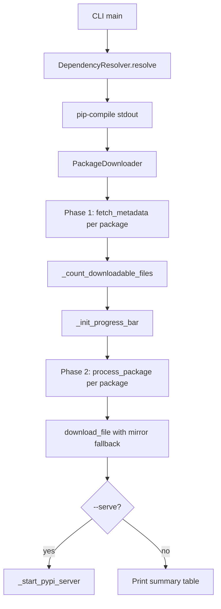

# Technical Specification (SPEC)

## 1. Technical Constraints

### 1.1 Runtime Environment

- **Python Version**: `3.13`(/home/tsc/tsc_tools/micromamba/envs/tsc_python/bin/python3).
- **Local Bash**: Version `5` or higher.
- **Target Host Bash**: Version `4` or higher.

### 1.2 Mandatory Requirements

- All documentation and code must use **half-width (ASCII)** punctuation.
- Python code must follow **Object-Oriented Programming (OOP)** principles.
- Python path operations must exclusively use the `pathlib` standard library.
- Logging must be managed via `loguru`. The logging module must be encapsulated in `tsc_logger.py` under the `lib` directory.
- Database management must utilize an **ORM**.
- Any API interface must provide **Swagger** documentation.
- Python `requests` usage must employ a persistent `Session` object.
- **MCP** tools must include explicit English `instructions` in their definitions.
- **LANGUAGE** Comments must use English.
- Python YAML parsing must strictly use `yaml.safe_load()` or `yaml.safe_load_all()`.
- Python code must use **Google-style Docstrings**.
- JavaScript code must use **JSDoc**.
- Shell scripts must use **Google-style function comments**.
- Python code must include **type hints**.
- A `README.md` file must exist at the project root, describing the project's functionality, installation, configuration, and usage.
- A `release-note.md` file must exist at the project root to describe version changes. The third line must explicitly state the current version using the format: `## Version=1.5.0` (replace with actual version).
- **Containerization** (Optional): If using Docker for deployment, a `Dockerfile` must exist at the project root for containerization. If using Docker Compose for local development, a `compose.yml` file must exist (Use of `docker-compose.yml` is deprecated).

### 1.3 Prohibitions

- **No Emojis**: Forbidden in all documentation and code.
- **No ASCII Art**: Forbidden in all documentation and code. Use **Mermaid** flowchart syntax if diagrams are necessary.
- **No Procedural Python**: Object-Oriented Programming is mandatory; procedural style is forbidden.
- **No Raw SQL (Primary Rule)**: Database management and operations must primarily use an **ORM**. **Exception**: `Raw SQL` is allowed **only** for complex read-only analytics or when ORM performance proves insufficient, subject to **Code Review approval**.
- **No Pickle**: Python `pickle` serialization is forbidden.
- **No `os.path`**: Python path operations using `os.path` are forbidden (use `pathlib` instead).
- **No TypeScript**: TypeScript is forbidden.
- **No Full-width Punctuation**: Full-width characters are forbidden in all documentation and code.
- **No Complex Shell Logic**: Shell scripts must not use compound statements like multiple `||` or `&&`. Use explicit `if/else/elif` blocks instead.
- **No Insecure Deserialization**: Forbidden. Always validate and sanitize data from untrusted sources before processing (e.g., JSON payloads, YAML files from external sources).
- **No Hardcoded Secrets**: Forbidden. Secrets must be loaded from environment variables or secure vaults.

### 1.4 Preferred Choices

- **Backend Frameworks**:
  - **Django**: Default choice for projects requiring a complex built-in **admin interface**, **authentication system**, and rapid CRUD development. Leverages its "batteries-included" philosophy.
  - **FastAPI**: Preferred for high-concurrency APIs, microservices, or projects prioritizing minimal latency and asynchronous I/O. Suitable when a custom admin panel is preferred over Django's monolithic structure.
- **Interface Design**: `RESTful` > `RPC`; `Asynchronous` > `Synchronous`.
- **Database Operations**: `SQLAlchemy` (with `FastAPI`) or `Django ORM` (with `Django`) as the primary mechanism.
- **Configuration Files**: Priority order: `TOML` > `INI` > `YAML` > `JSON` > `Python Dict`.
- **MCP Transport**: Prefer `Streamable HTTP` over `SSE`.
- **MCP Tools**: All tool definitions must include explicit **English** `instructions` detailing preconditions, inputs, and expected outputs.
- **Security & Safety**: Avoid `eval()` in Python and Shell. If absolutely necessary, **must request manual human confirmation** before execution.
- **WebSockets**: Do not consider WebSockets unless bidirectional interaction is strictly required.
- **LOG**: Prefer more detailed logging (from debug to error levels). Whenever attempting to fix a bug, add additional logs directly within the malfunctioning code to aid diagnosis.

### 1.5 Code Formatting & Validation

If validation fails, prompt the user for manual intervention.

- **Python Scripts**:
  - Type checking via `mypy`.
  - Formatting via `black`.
  - Linting via `pylint`.
- **Shell Scripts**:
  - Formatting via `dev_tools/shfmt`.
  - Validation via `dev_tools/shellcheck`.
- **Ansible Playbooks**:
  - Validation via `ansible-lint`.
- **JavaScript**:
  - Linting via `eslint` (Google Style Guide).

---

## 2. pypi-downloader Product Requirements

### 2.1 Product Overview

pypi-downloader is an async CLI tool for downloading Python packages from PyPI (or Chinese mirrors) and serving them as a private offline index. It is designed for air-gapped or restricted network environments where developers cannot access the public internet directly.

Current version: 0.8.1

### 2.2 Functional Requirements

#### 2.2.1 Dependency Resolution

- Dependencies MUST always be resolved via `pip-compile` (pip-tools) before downloading.
- Resolution MUST support both official PyPI and Chinese mirrors (controlled by `--cn`).
- Resolved output MUST be returned as an in-memory string; no temporary files are written to disk.
- The `DependencyResolver` class in `resolver.py` encapsulates all pip-compile interactions.

#### 2.2.2 Package Download

- Downloads MUST be performed asynchronously using `aiohttp`.
- Default concurrency is 16 streams, configurable via `--concurrency`.
- Each downloaded file MUST be verified against the SHA-256 digest from the PyPI JSON API.
- If a file already exists and its hash matches, the download MUST be skipped.
- File I/O (write, hash computation, existence check) MUST run in a `ThreadPoolExecutor` to avoid blocking the event loop.

#### 2.2.3 Mirror Fallback

- When `--cn` is set, 14 Chinese mirrors are used in randomized order, with official PyPI as the last resort.
- When `--cn` is not set, only official PyPI (`https://pypi.org`) is used.
- After `RETRIES_PER_MIRROR` (2) consecutive failures on a mirror, the tool MUST switch to the next mirror.
- Total retry budget per file is `DEFAULT_RETRIES` (32).

#### 2.2.4 Version Filtering

- `--all-versions`: download all Python 3 compatible versions of each package.
- `--latest-patch`: for each (major, minor) group, keep only the highest patch version. Uses PEP 440 compliant comparison via the `packaging` library.
- `--all-versions` and `--latest-patch` are mutually exclusive.
- Python 2 only wheels (no py3/cp3 tags) MUST always be filtered out regardless of other flags.

#### 2.2.5 Platform Filtering

- `--python-version`, `--abi`, `--platform` filter wheel files by their PEP 425 tags.
- Source distributions (`.tar.gz`, `.zip`) always pass through platform filters.
- Filtering logic is implemented in `PackageDownloader.matches_filter()`.

#### 2.2.6 Dry-Run Mode

- When `--dry-run` is set, no files are downloaded.
- All resolved download URLs MUST be saved to a file (default: `./url_list.txt`, configurable via `--url-list-path`).

#### 2.2.7 Private PyPI Server

- When `--serve` is set (and `--dry-run` is not), a `pypiserver` instance MUST be started after downloading completes.
- The server serves packages from the download directory.
- Default port is 8080, configurable via `--serve-port`.
- `pypiserver` is an optional dependency; a clear error message MUST be shown if it is not installed.
- The server blocks until the user sends Ctrl+C.

#### 2.2.8 Progress Display

- During downloads, a Rich Live display MUST show the last 20 log lines and a progress bar.
- The progress bar shows: description, visual bar, percentage, and file count (completed/total).
- The total file count MUST be computed in Phase 1 (metadata phase) before Phase 2 (download phase) begins.

### 2.3 Non-Functional Requirements

#### 2.3.1 Performance

- Phase 1 (metadata fetch) runs sequentially per package to avoid overwhelming mirrors.
- Phase 2 (download) runs all packages concurrently, controlled by a semaphore.
- Thread pool size: `min(32, CPU_COUNT * 4)`.

#### 2.3.2 Logging

- All log output uses `loguru`.
- Terminal display uses Rich Live (DEBUG+ level) during Phase 2.
- A rotating log file (`pypi-downloader.log`, 10 MB rotation, 3 backups) captures TRACE+ level.
- Download URLs are logged at TRACE level (file only, not shown on screen).

#### 2.3.3 Compatibility

- Requires Python 3.11+.
- Uses `pip` User-Agent (`pip/24.0`) to avoid being blocked by PyPI mirrors.
- Wheel filename parsing follows PEP 425.
- Version comparison follows PEP 440 via the `packaging` library.

### 2.4 Architecture

### 2.5 Dependency Matrix

| Package | Version | License | Role |
|---|---|---|---|
| aiohttp | >=3.11 | Apache-2.0 AND MIT | Async HTTP client |
| loguru | >=0.6 | MIT | Logging |
| rich | >=12.0 | MIT | Terminal UI and progress |
| pip-tools | >=7.0.0 | BSD-3-Clause | Dependency resolution (pip-compile) |
| packaging | >=21.0 | Apache-2.0 OR BSD-2-Clause | PEP 440 version comparison |
| pypiserver | >=2.0.0 | MIT AND Zlib | Optional: private PyPI server (--serve) |

### 2.6 Removed Features

The following features were present in earlier versions and have been permanently removed:

| Feature | Removed in | Replacement |
|---|---|---|
| `--resolve-deps` flag | v0.8.0 | Resolution is now always automatic |
| `--build-index` flag | v0.8.0 | Use `--serve` (pypiserver) instead |
| `pip2pi` / `dir2pi` dependency | v0.8.0 | `pypiserver` generates the index at runtime |
| `tqdm` progress bar | v0.4.0 | Rich Live display |
